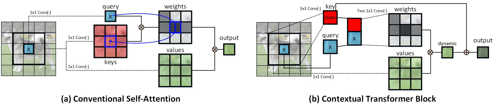

# Introduction
This repository is the official implementation of [**Contextual Transformer Networks for Visual Recognition**](https://arxiv.org/pdf/2107.12292.pdf) for **Object Detection** and **Instance Segmentation**. 

CoT is a unified self-attention building block, and acts as an alternative to standard convolutions in ConvNet. As a result, it is feasible to replace convolutions with their CoT counterparts for strengthening vision backbones with contextualized self-attention.

<p align="center">
  
</p>

# Usage
### Requirement:
* PyTorch 1.8.0+
* Python3.7
* CUDA 10.1+
* [CuPy](https://cupy.dev/). 
* [detectron2](https://github.com/facebookresearch/detectron2)

### Clone the repository:
```
git clone https://github.com/JDAI-CV/CoTNet-ObjectDetection-InstanceSegmentation.git
```

### Train 
First, download the [COCO](https://cocodataset.org/#home) dataset. Then copy the code into detectron2 and build detectron2. To train CoTNet-50 on a single node with 8 gpus:
```
python3 tools/train_net.py --num-gpus 8 --config-file configs/ObjectDetection/Faster-RCNN/CoTNet-50/faster_rcnn_CoT_50_FPN_1x.yaml
```
The training configs for CoTNet (e.g., CoTNet-50) can be found in the [configs](configs) folder.

The **pre-trained CoTNet models** for Object Detection and Instance Segmentation can be downloaded [here](https://drive.google.com/drive/folders/1TQNwMatwmfKgjbIgFdfbIH-4vkfZ07Ag?usp=sharing).

# Results on Object Detection task
### Faster-RCNN
|  Backbone  |  AP  | AP50   |  AP75 | APs  | APm  | APl  | config file | 
| :------------: | :------------: | :------------: | :------------: | :------------: | :------------: | :------------: |  :------------: |
| CoTNet-50 | 43.50 | 64.84 | 47.53 | 26.36 | 47.54 | 56.49 | [log/config](configs/ObjectDetection/Faster-RCNN/CoTNet-50) |
| CoTNeXt-50 | 44.06 | 65.76 | 47.65 | 27.08 | 47.70 | 57.21 | [log/config](configs/ObjectDetection/Faster-RCNN/CoTNeXt-50) |
| SE-CoTNetD-50 | 43.96 | 65.20 | 48.25 | 27.71 | 47.05 | 56.51 | [log/config](configs/ObjectDetection/Faster-RCNN/SE-CoTNetD-50) |
| CoTNet-101 | 45.35 | 66.80 | 49.18 | 28.65 | 49.47 | 58.82 | [log/config](configs/ObjectDetection/Faster-RCNN/CoTNet-101) |
| CoTNeXt-101 | 46.10 | 67.50 | 50.22 | 29.44 | 49.84 | 59.26 | [log/config](configs/ObjectDetection/Faster-RCNN/CoTNeXt-101) |
| SE-CoTNetD-101 | 45.66 | 66.86 | 50.11 | 29.83 | 49.25 | 59.17 | [log/config](configs/ObjectDetection/Faster-RCNN/SE-CoTNetD-101) | 

### Cascade-RCNN
|  Backbone  |  AP  | AP50   |  AP75 | APs  | APm  | APl  | config file |
| :------------: | :------------: | :------------: | :------------: | :------------: | :------------: | :------------: |  :------------: |
| CoTNet-50 | 46.11 | 64.68 | 49.75 | 28.71 | 49.76 | 60.28 | [log/config](configs/ObjectDetection/Cascade-RCNN/CoTNet-50/) |
| CoTNeXt-50  | 46.79 | 65.54 | 50.53 | 29.74 | 50.49 | 61.04 | [log/config](configs/ObjectDetection/Cascade-RCNN/CoTNeXt-50) |
| SE-CoTNetD-50 | 46.77 | 64.91 | 50.46 | 28.90 | 50.28 | 60.92 | [log/config](configs/ObjectDetection/Cascade-RCNN/SE-CoTNetD-50) |
| CoTNet-101  | 48.19 | 67.00 | 52.17 | 30.00 | 52.32 | 62.87 | [log/config](configs/ObjectDetection/Cascade-RCNN/CoTNet-101) |
| CoTNeXt-101 | 49.02 | 67.67 | 53.03 | 31.44 | 52.95 | 63.17 | [log/config](configs/ObjectDetection/Cascade-RCNN/CoTNeXt-101) |
| SE-CoTNetD-101 | 49.02 | 67.78 | 53.15 | 31.26 | 52.76 | 63.29 | [log/config](configs/ObjectDetection/Cascade-RCNN/SE-CoTNetD-101) |

# Results on Instance Segmentation task
### Mask-RCNN
|  Backbone  |  AP(bb)  | AP50(bb)   |  AP75(bb) | AP(mk)  | AP50(mk)  | AP75(mk)  | config file |
| :------------: | :------------: | :------------: | :------------: | :------------: | :------------: | :------------: |  :------------: |
| CoTNet-50   | 44.06 | 64.99 | 48.29 | 39.28 | 62.12 | 42.17 | [log/config](configs/InstanceSegmentation/Mask-RCNN/CoTNet-50) |
| CoTNeXt-50  | 44.47 | 65.74 | 48.71 | 39.62 | 62.70 | 42.35 | [log/config](configs/InstanceSegmentation/Mask-RCNN/CoTNeXt-50) |
| SE-CoTNetD-50 | 44.16 | 65.26 | 48.32 | 39.38 | 62.18 | 42.23 | [log/config](configs/InstanceSegmentation/Mask-RCNN/SE-CoTNetD-50) |
| CoTNet-101  | 46.17 | 67.17 | 50.63 | 40.86 | 64.18 | 43.64 | [log/config](configs/InstanceSegmentation/Mask-RCNN/CoTNet-101) |
| CoTNeXt-101 | 46.66 | 67.70 | 50.90 | 41.21 | 64.45 | 44.27 | [log/config](configs/InstanceSegmentation/Mask-RCNN/CoTNeXt-101) |
| SE-CoTNetD-101 | 46.67 | 67.85 | 51.30 | 41.53 | 64.92 | 44.69 | [log/config](configs/InstanceSegmentation/Mask-RCNN/SE-CoTNetD-101) |

### Cascade-Mask-RCNN
|  Backbone  |  AP(bb)  | AP50(bb)   |  AP75(bb) | AP(mk)  | AP50(mk)  | AP75(mk)  | config file |
| :------------: | :------------: | :------------: | :------------: | :------------: | :------------: | :------------: |  :------------: |
| CoTNet-50   | 46.94 | 65.36 | 50.69 | 40.25 | 62.37 | 43.38 | [log/config](configs/InstanceSegmentation/Cascade-Mask-RCNN/CoTNet-50) |
| CoTNeXt-50  | 47.63 | 65.93 | 51.64 | 40.76 | 63.32 | 44.01 | [log/config](configs/InstanceSegmentation/Cascade-Mask-RCNN/CoTNeXt-50) |
| SE-CoTNetD-50 | 47.44 | 65.93 | 51.27 | 40.73 | 63.22 | 44.09 | [log/config](configs/InstanceSegmentation/Cascade-Mask-RCNN/SE-CoTNetD-50) |
| CoTNet-101  | 48.97 | 67.42 | 53.10 | 41.98 | 64.81 | 45.39 | [log/config](configs/InstanceSegmentation/Cascade-Mask-RCNN/CoTNet-101) |
| CoTNeXt-101 | 49.35 | 67.88 | 53.53 | 42.20 | 65.00 | 45.69 | [log/config](configs/InstanceSegmentation/Cascade-Mask-RCNN/CoTNeXt-101) |
| SE-CoTNetD-101 | 49.24 | 67.45 | 53.36 | 42.38 | 64.79 | 45.89 | [log/config](configs/InstanceSegmentation/Cascade-Mask-RCNN/SE-CoTNetD-101) | 

## Citing Contextual Transformer Networks
```
@article{cotnet,
  title={Contextual Transformer Networks for Visual Recognition},
  author={Li, Yehao and Yao, Ting and Pan, Yingwei and Mei, Tao},
  journal={arXiv preprint arXiv:2107.12292},
  year={2021}
}
```

## Acknowledgements
Thanks the contribution of [timm](https://github.com/rwightman/pytorch-image-models) and awesome PyTorch team.
